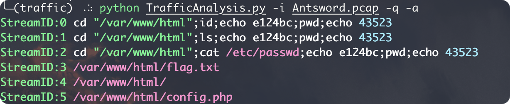

# TrafficAnalysis

分析处理流量，可以快速筛选流量并解密蚁剑流量。

<!-- PROJECT SHIELDS -->

[![Contributors][contributors-shield]][contributors-url]
[![Forks][forks-shield]][forks-url]
[![Stargazers][stars-shield]][stars-url]
[![Issues][issues-shield]][issues-url]
[![MIT License][license-shield]][license-url]
[![LinkedIn][linkedin-shield]][linkedin-url]

<!-- PROJECT LOGO -->
<br />

<p align="center">
  <a href="https://github.com/cmacckk/TrafficAnalysis">
    
  </a>

  <h3 align="center">Traffic Analysis</h3>
  <p align="center">
    流量分析工具
    <br />
    <a href="https://github.com/cmacckk/TrafficAnalysis"><strong>探索本项目的文档 »</strong></a>
    <br />
    <br />
    <a href="https://github.com/cmacckk/TrafficAnalysis">查看Demo</a>
    ·
    <a href="https://github.com/cmacckk/TrafficAnalysis/issues">报告Bug</a>
    ·
    <a href="https://github.com/cmacckk/TrafficAnalysis/issues">提出新特性</a>
  </p>


</p>


 本篇README.md面向开发者

## 目录

- [上手指南](#上手指南)
  - [开发前的配置要求](#开发前的配置要求)
  - [安装步骤](#安装步骤)
- [文件目录说明](#文件目录说明)
- [使用方法](#使用方法)
- [开发的架构](#开发的架构)
- [部署](#部署)
- [使用到的框架](#使用到的框架)
- [贡献者](#贡献者)
  - [如何参与开源项目](#如何参与开源项目)
- [版本控制](#版本控制)
- [作者](#作者)

### 上手指南

###### 开发前的配置要求

1. Python >= 3

###### **安装步骤**

1. 克隆仓库

   ```bash
   git clone https://github.com/cmacckk/TrafficAnalysis
   ```

2. 安装第三方库

   ```bash
   pip install -r requirements.txt
   ```

### 文件目录说明

eg:

```
filetree
├── Antsword.pcap
├── README.md
├── TrafficAnalysis.py
├── img
│   └── logo.png
└── requirements.txt

2 directories, 5 files
```

### 使用方法

查看流量

```bash
# 查看所有流量
$ python TrafficAnalysis.py -i Antsword.pcap
# 仅查看请求流量
$ python TrafficAnalysis.py -i Antsword.pcap -q
或
$ python TrafficAnalysis.py -i Antsword.pcap --request
# 仅查看响应流量
$ python TrafficAnalysis.py -i Antsword.pcap -r
或
$ python TrafficAnalysis.py -i Antsword.pcap --response
# 查看帧流量或范围
# 查看1-99帧号间的HTTP流量
python TrafficAnalysis.py -i Antsword.pcap -s 1-99
python TrafficAnalysis.py -i Antsword.pcap --scope 1-99
# 查看1-99帧号间的HTTP请求流量
python TrafficAnalysis.py -i Antsword.pcap --request -s 1-99
# 查看1-99帧号间的HTTP响应流量
python TrafficAnalysis.py -i Antsword.pcap --response -s 1-99
# 查看24帧号间的HTTP流量
python TrafficAnalysis.py -i Antsword.pcap --response -s 24
# 查看tcp流ID为0的HTTP流量
python TrafficAnalysis.py -i Antsword.pcap -n 0
python TrafficAnalysis.py -i Antsword.pcap --num 0
```

查看所有流量


仅查看请求流量


仅查看响应流量


查看tcp流ID为0的HTTP流量


解密流量

```bash
# 查看所有蚁剑解密流量
$ python TrafficAnalysis.py -i Antsword.pcap -a
# 仅查看蚁剑解密的请求流量
$ python TrafficAnalysis.py -i Antsword.pcap -q -a
或
$ python TrafficAnalysis.py -i Antsword.pcap --request  -a
# 仅查看蚁剑解密的响应流量
$ python TrafficAnalysis.py -i Antsword.pcap -r -a
或
$ python TrafficAnalysis.py -i Antsword.pcap --response -a
# 查看蚁剑解密的帧流量或范围
# 查看1-99帧号间蚁剑解密的的HTTP流量
python TrafficAnalysis.py -i Antsword.pcap -s 1-99 -a
python TrafficAnalysis.py -i Antsword.pcap --scope 1-99 -a
# 查看1-99帧号间蚁剑解密的HTTP请求流量
python TrafficAnalysis.py -i Antsword.pcap --request -s 1-99 -a
# 查看1-99帧号间蚁剑解密的HTTP响应流量
python TrafficAnalysis.py -i Antsword.pcap --response -s 1-99 -a
# 查看24帧号间蚁剑解密的HTTP流量
python TrafficAnalysis.py -i Antsword.pcap --response -s 24 -a
# 查看tcp流ID为0蚁剑解密的HTTP流量
python TrafficAnalysis.py -i Antsword.pcap -n 0 -a
python TrafficAnalysis.py -i Antsword.pcap --num 0 -a
```

查看所有蚁剑解密流量


仅查看蚁剑解密的请求流量



### 开发的架构 

请阅读[ARCHITECTURE.md](https://github.com/cmacckk/TrafficAnalysis/blob/master/ARCHITECTURE.md) 查阅为该项目的架构。

### 部署

暂无

### 使用到的第三方库

- [pyshark](https://github.com/KimiNewt/pyshark)
- [rich](https://github.com/Textualize/rich)

### 贡献者

请阅读**CONTRIBUTING.md** 查阅为该项目做出贡献的开发者。

### 版本控制

该项目使用Git进行版本管理。您可以在repository参看当前可用版本。

### 作者

emailforgty@163.com 

 *您也可以在贡献者名单中参看所有参与该项目的开发者。*

### 版权说明

该项目签署了MIT 授权许可，详情请参阅 [LICENSE.txt](https://github.com/shaojintian/Best_README_template/blob/master/LICENSE.txt)

### 鸣谢


- [pyshark](https://github.com/KimiNewt/pyshark)

- [rich](https://github.com/Textualize/rich)
